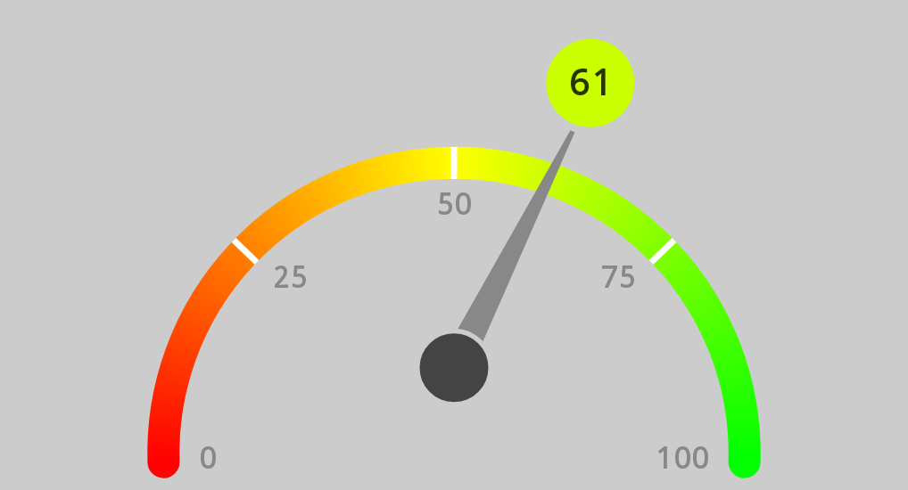
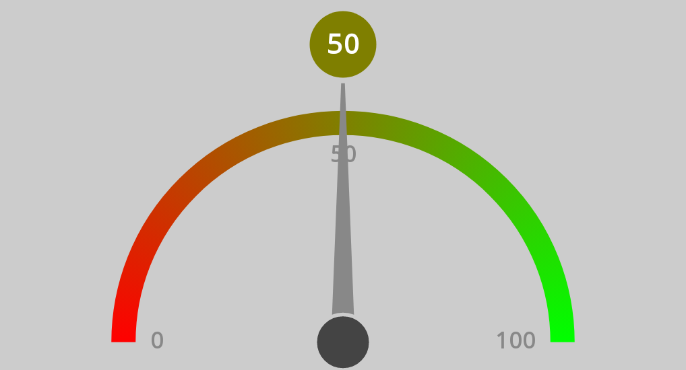
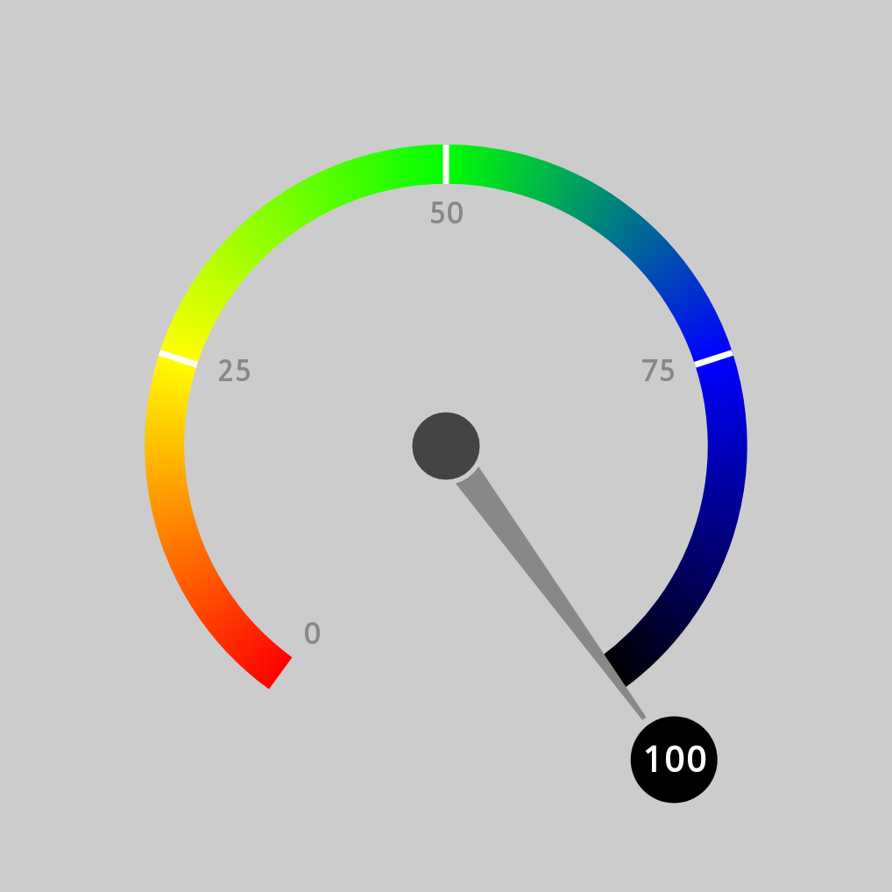
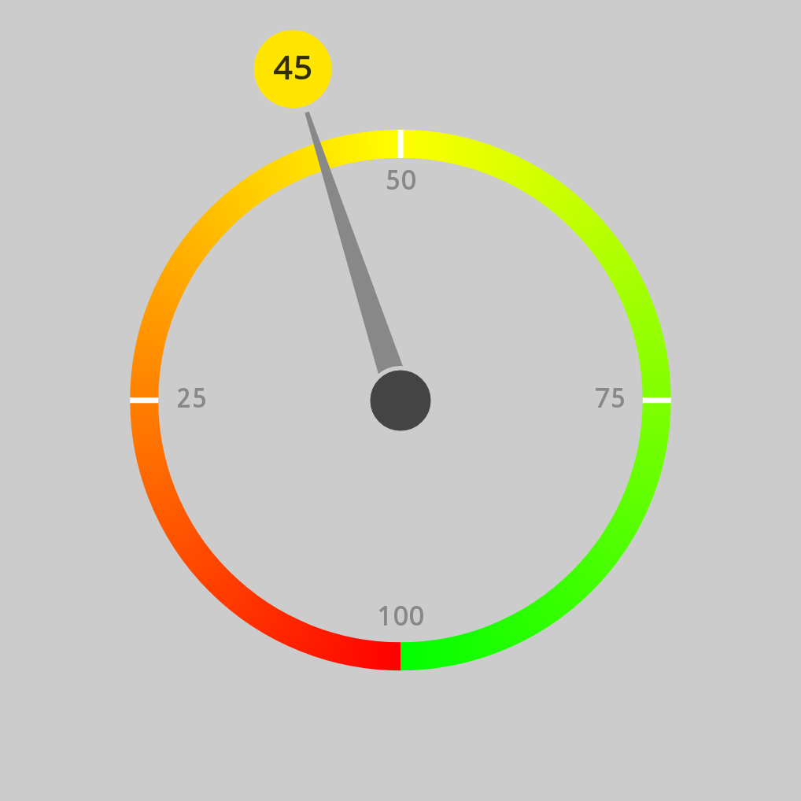
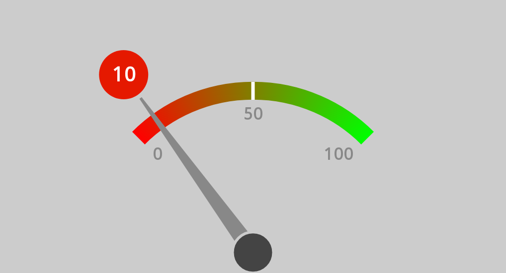
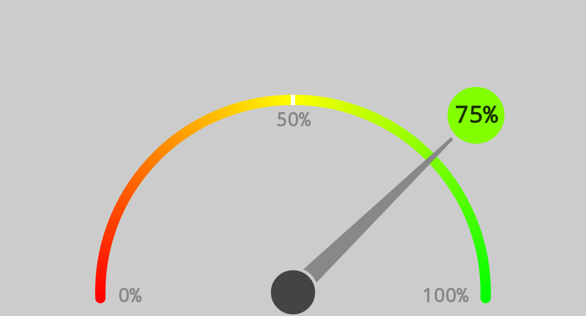
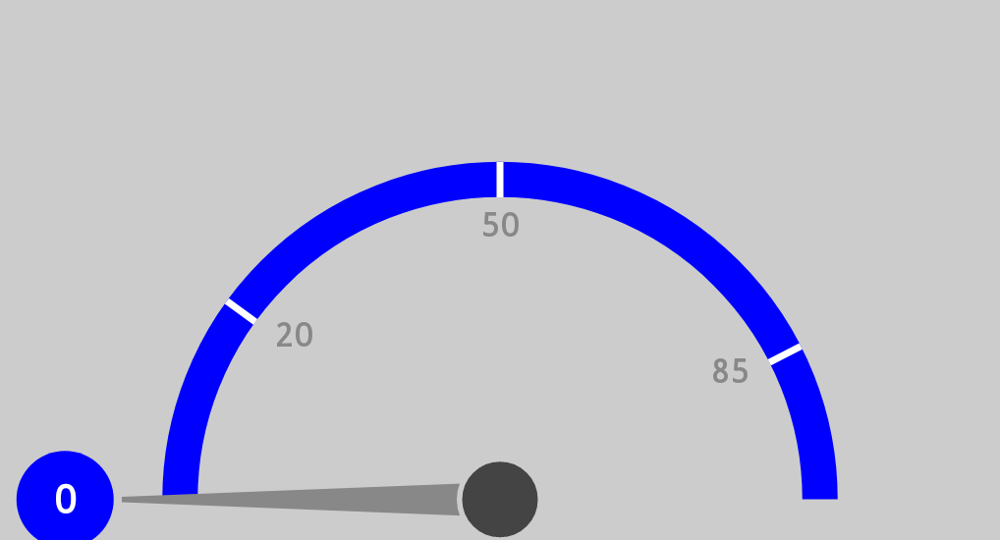
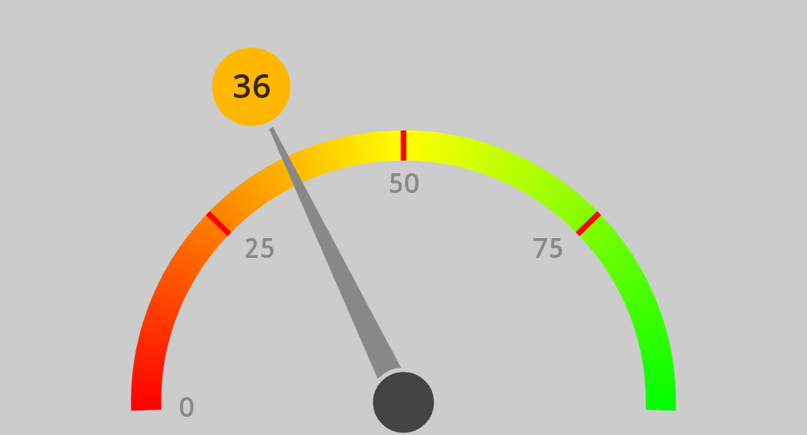
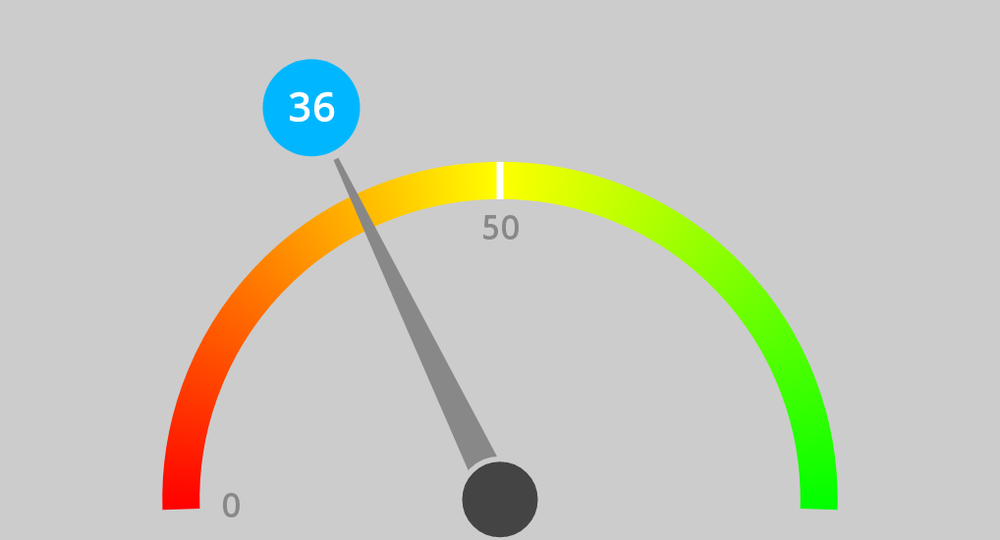

## Gauge Chart

Customizable GaugeChart / SpeedometerChart for Jetpack Compose

### Install

[](https://jitpack.io/#jemshit/GaugeChart)

```kotlin
implementation("com.jemshit.GaugeChart:GaugeChart:x.y.z")
```

### Usage

```kotlin
GaugeChart(width = 370.dp,
           height = 200.dp,

           arcLength = 0.51f,
           arcDrawStyle = Stroke(36f, cap = StrokeCap.Round),
           steps = listOf(0, 25, 50, 75, 100),
           currentStep = 61
)
```



### Customize

`ParameterName:Type = DefaultValue`

I know, parameterCeption, sorry

```kotlin
// 0.5f for half circle, 1f for full circle.
arcLength: Float = 0.51f
// arc curve draw size, style
arcDrawStyle: Stroke = Stroke(36f, cap = StrokeCap.Butt)
// arc curve color list, it will smoothly shift from one color to the next (gradient)
arcColors: List<Color> = listOf(Color.Red, Color.Yellow, Color.Green)

// step texts with dividers are shown on curve, value between [0-100], like percent
steps: List<Int> = listOf(0, 50, 100)
// to show % sign on current step text 
stepsPercentSign: Boolean = false
// step text paint
stepsPaint: android.graphics.Paint? = null

// show step markers
stepMarkers: Boolean = true
stepMarkerColor: Color = Color.White
stepMarkerWidth: Float = 7f

// indicator's current step, you can update this value and it will be animated
currentStep: Int? = 69
// indicator/needle bottom margin
indicatorBottomMargin: Float = 0f
// current step text paint
currentStepPaint: android.graphics.Paint? = null
// Pair<step_start, step_end> -> Pair<step_start_color, step_end_color>
// auto generated if null
// mapOf(Pair(0,50) to Pair(Color.Red, Color.Yellow), Pair(50,100) to Pair(Color.Yellow, Color.Green))
currentStepBgColors: Map<Pair<Int, Int>, Pair<Color, Color>>? = null
// Pair<step_start, step_end> -> step_text_color
// auto generated if null
currentStepTextColors: Map<Pair<Int, Int>, Color>? = null

indicatorBellyColor: Color = Color.DarkGray
indicatorBellyBorderColor: Color = Color.LightGray
indicatorNeedleColor: Color = Color.Gray
```

<p>
  
&nbsp; &nbsp; &nbsp; &nbsp;
  
</p>

<p>
  
&nbsp; &nbsp; &nbsp; &nbsp;
  
</p>

<p>
  
&nbsp; &nbsp; &nbsp; &nbsp;
  
</p>

<p>
  
&nbsp; &nbsp; &nbsp; &nbsp;
  
</p>

<p>
  
&nbsp; &nbsp; &nbsp; &nbsp;
</p>